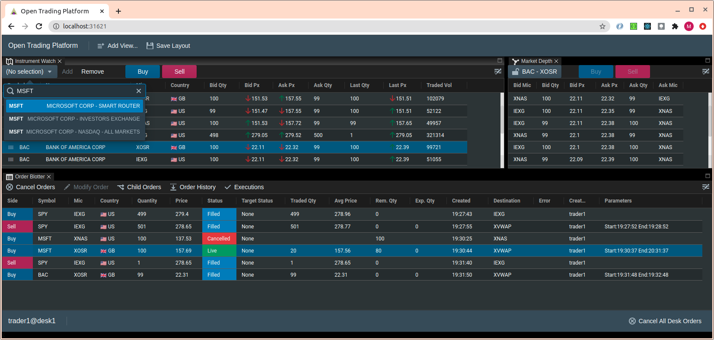

## Open Trading Platform 

An open source highly scaleable platform for building cross asset execution orientated trading applications that can be easily deployed on-prem or in the cloud.

### Table of contents
1. [synopsis](#synopsis)
2. [architecture overview](#architectureoverview)
3. [services](#services)
4. [where could it be useful?](#wherecoulditbeuseful)
5. [about the author](#abouttheauthor)

## synopsis 

The platform consists of a number of services (e.g. Order Manager, Smart Router, Quote Aggregator, VWAP Strategy, Strategy Framework, Venue Gateways etc, see [services](#services)) that are common in execution orientated trading applications, the technologies and languages utilised by the platform are detailed in the [architecture overview](#architectureoverview).  The aim and guiding principles behind the platform are outlined below.  To get an out of the box configuration of the platform running with which to interact see [here](https://github.com/ettec/open-trading-platform/blob/master/install/README.md) for the simple installation guide.

A common choice typically faced by companies with demanding trading execution requirements  is between choosing a vendor solution or building a bespoke solution.  The vendor platform option usually lacks flexibility and ends up costing materially more than initially allowed for once the costs of running and customising the platform are considered.  The bespoke solution is highly flexible but has a large upfront development cost and can have a higher ongoing maintenance cost (though this is not necessarily the case as platform specialists are usually required to modify and maintain the vendor solution). 

The aim of OTP is to offer a 3rd option that gives the flexibility of a bespoke solution without the high upfront development costs and with reduced maintenance costs.  OTP is released under a GPLv3 license meaning it is and always will be free.  The platform makes extensive use best of breed open source projects to meet the, frankly more complex, non-functional requirements of a typical trading platform, this reduces maintenance costs and enhances the robustness of the system.  Through the extensive use of open source projects the ratio of OTP code to functionality is low which, importantly, also means the barrier to understanding and modifying the OTP code is low.

The details of the key open source projects used in OTP are outlined in the next section, but the guiding philosophy when deciding whether to use an open source project throughout the building of this platform has been much akin to that of the requirements for a [CNCF](https://www.cncf.io/) graduated project (of which a number are used in OTP), which in essence can be summarised as:  the project is in use and maintained by multiple significant technology organisations and has been shown to follow best practice.  

## architecture overview 

Below is the list of key technologies used in OTP and a brief explanation of each technology.  Obviously such a short explanation cannot do full justice to each technology and it is primarily intended to illustrate how the technology is used and the main benefits from the point of view of the OTP platform.

#### language overview

All server side components are written in Golang, apart from the FIX Market Simulator which is written in Java (historical reasons, i.e. it was the language I knew best when starting the project).  The core of the code used by the Golang services is located in the Golang module  https://github.com/ettec/otp-common which is really the 'guts' of the server side platform components (it contains the order manager, trading strategy framework, market data distribution code and other important artefacts used across the platform) 

The client is a single page web application written in Typescript using the React library.  

#### open source projects

**Kubernetes:** The platform is designed to easily scale across many instruments and orders, Kubernetes makes the process of scaling up or down the platform very easy.  A second advantage of using kubernetes it that it's as easy to deploy OTP in the cloud as it is to deploy it on-prem.   Thirdly, deploying a development scale instance of the platform is very easy which helps speed the development process.

**Helm:** Automates the install of platform components.

**Kafka:** Essentially a distributed transaction log, this is used to distribute order and execution information across the platform.  Using this as the backbone of the system makes scaling the order store very straightforward (through increasing the number of order topic partitions to increase I/O parallelism).  A second advantage of using Kafka is that it enables a full state-by-state order change history to be kept (see for example the `Order History` button on the Order Blotter).

**Protobuf:** Used to define the business model and service apis of the platform and makes it easy to share the business model and service apis across both the server and client.

**gRPC:**  a cross language binary communication protocol that provides a standardised, strongly typed means for the platform services to communicate via streams or Rpc calls.

**Envoy/grpc-web:**  the front end's gateway to the OTP platform services.  It allows both the protobuf business model and grpc service apis to be seemlessly shared by the react client.  Also supports streaming data to the client. 

**Prometheus:**  used to capture significant real-time and historical per service performance stats such as quote fan in/fan out, order counts etc. 

**Postgresql:** used as a store for the platform's static data (instruments, markets, listings etc) and front end configuration data

**Grafana:**  a number of OTP specific dashboards are provided as part of the platform to assist with monitoring.

**QuickFixGo/QuickFixJ:** fix engines used to communicate between the platform's order gateways and market simulators.

**Ag Grid:** Used for all the grids in the GUI.  As a grid implementation for trading applications I can't praise this highly enough, simply superb.  

**Caplin Flexlayout:** a great GUI layout manager for a trading application, originally written as such and generously open sourced by Caplin.

**BlueprintJS:**  a library of GUI components optimized for building complex data-dense interfaces; there is a strong affinity between this type of application and a trading application, I have found it to be a good match in practice.

## services  

Below is a list of links to the  source route and README file of each platform service that further elaborates upon the details of the service.  Note, a basic familiarity with Kubernetes will be beneficial to help with understanding some of the terminology used in the README files.

[authorization-service](https://github.com/ettec/open-trading-platform/blob/master/go/authorization-service)

[client-config-service](https://github.com/ettec/open-trading-platform/blob/master/go/client-config-service)

[fix-market-simulator](https://github.com/ettec/open-trading-platform/blob/master/java/fixmarketsimulator)

[fix-sim-execution-venue](https://github.com/ettec/open-trading-platform/blob/master/go/execution-venues/fix-sim-execution-venue)

[market-data-gateway-fixsim](https://github.com/ettec/open-trading-platform/blob/master/go/market-data/market-data-gateway-fixsim)

[market-data-service](https://github.com/ettec/open-trading-platform/blob/master/go/market-data/market-data-service)

[opentp-client](https://github.com/ettec/open-trading-platform/blob/master/react/opentp-client)

[order-data-service](https://github.com/ettec/open-trading-platform/blob/master/go/order-data-service)

[order-monitor](https://github.com/ettec/open-trading-platform/blob/master/go/order-monitor)

[order-router](https://github.com/ettec/open-trading-platform/blob/master/go/execution-venues/order-router)

[quote-aggregator](https://github.com/ettec/open-trading-platform/tree/master/go/market-data/quote-aggregator)

[smart-router](https://github.com/ettec/open-trading-platform/tree/master/go/execution-venues/smart-router)

[static-data-service](https://github.com/ettec/open-trading-platform/blob/master/go/static-data-service)

[vwap-strategy](https://github.com/ettec/open-trading-platform/blob/master/go/execution-venues/vwap-strategy)

## where could it be useful?  

OTP's primary benefit is as an example of one way in which an execution platform could be built and as a way of giving some confidence that the technologies used are appropriate for this problem space.  The value here could be from using it as a starting point to give a project a leg-up or just as an approach to consider to guide your own thinking.  

## about the author 

Coding since I was 10, I took a detour via a Physics degree, but the pull of coding was just too much for me to resist and I ended up as a software engineer at a number of mainly financial organisations working primarily on front office trading systems.   I started tentatively building what would become OTP towards the end of 2019 initially as a way of exploring technologies.  The more I built the more I could see that the unique combination of technologies could yield an innovative trading execution platform and so set out to build the most common components you would expect in such a platform. 

